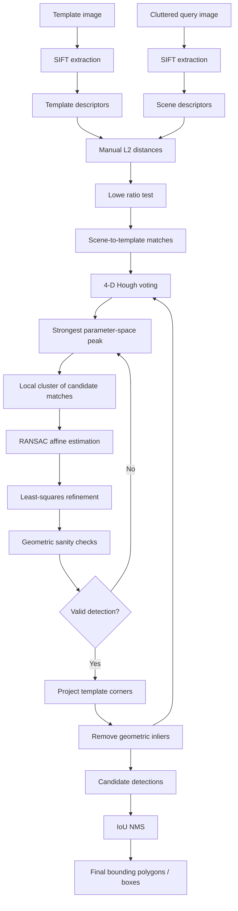
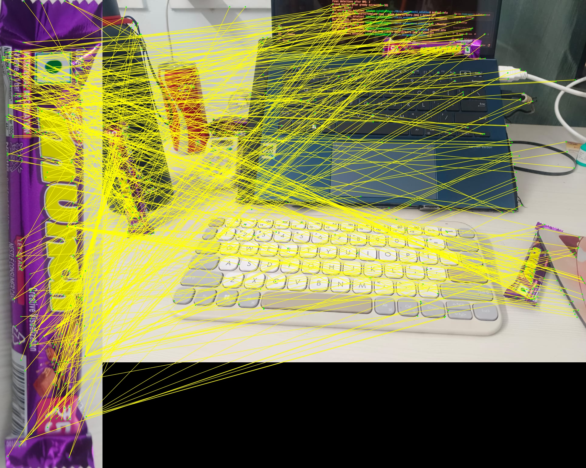
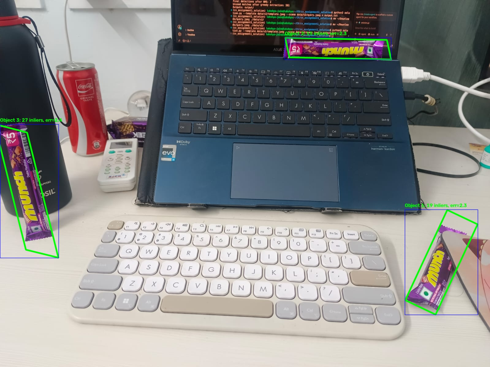
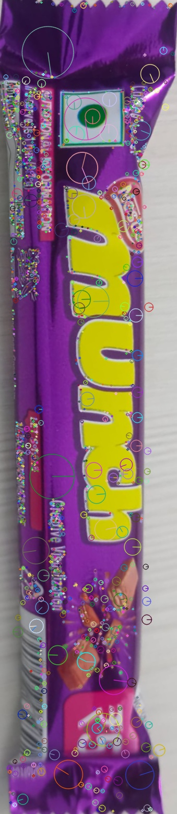
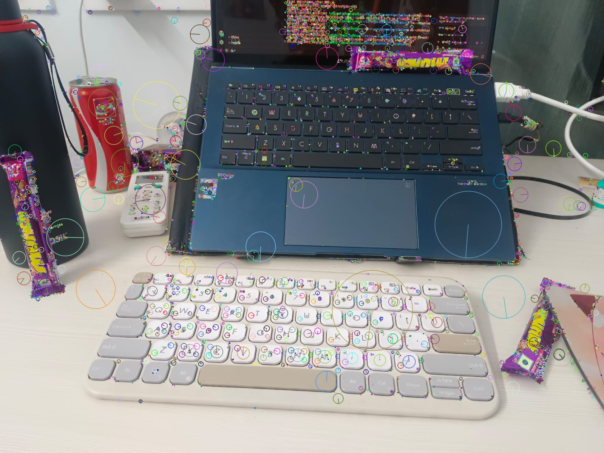

# Assignment 1 Report — Multi-Instance Object Recognition in Cluttered Scenes

- **Student:** Lakshya Jain (B2CS1032)
- **Object:** Repeated object in the v2.1 (frozen) scene
- **Template image:** `data/v2.1/template.jpeg`
- **Query image:** `data/v2.1/query.jpeg`


## 1. Objective

The goal is to detect and localize multiple instances of one specific object in a highly cluttered and partially occluded scene. The solution must tolerate changes in scale and rotation and remain robust when many feature matches come from unrelated background structure.

The required pipeline is based on SIFT local features, manual descriptor matching, a 4-D Generalized Hough Transform, affine geometric verification using RANSAC and least squares, sequential inlier subtraction, and IoU-based non-maximum suppression.

## 2. Pipeline overview



## 3. Why SIFT?

SIFT produces local descriptors intended to be robust to image scale and rotation and reasonably robust to affine distortion, viewpoint changes, noise and illumination changes. This makes it appropriate for the assignment's combination of rotation, scale variation, clutter and partial occlusion.

The descriptor is a 128-dimensional vector. We use OpenCV only for the permitted SIFT extraction step; the correspondence and geometric reasoning are implemented manually.

## 4. Feature correspondence

For every scene descriptor $q$ and template descriptor $t$, compute the Euclidean distance:

$$
d(q,t)=\left\|q-t\right\|_2
    =\sqrt{\sum_{k=1}^{128}(q_k-t_k)^2}.
$$

Let `d1` be the smallest distance and `d2` the second-smallest. Lowe's relative distance test accepts the correspondence when:

$$
\frac{d_1}{d_2}<\tau.
$$

The frozen run uses `tau = 0.85`, exposed as a command-line parameter.

### Why scene → template?

The same physical template keypoint can occur in several object instances in the scene. Therefore, imposing a one-to-one template/scene matching constraint would incorrectly discard legitimate repeated-instance matches. Scene → template matching permits several scene keypoints to select the same template keypoint.

## 5. 4-D Generalized Hough Transform

A local correspondence supplies more than a point match. SIFT also supplies keypoint scale and orientation.

For template keypoint $p$, scene keypoint $q$, template center $c$, template scale $s_t$, and scene scale $s_s$:

$$
s=\frac{s_s}{s_t},
\qquad
θ=θ_s-θ_t.
$$

The angle difference is converted from degrees to radians before constructing the 2-D rotation matrix:

$$
R(\theta)=
\begin{bmatrix}
\cos\theta&-\sin\theta\\
\sin\theta&\cos\theta
\end{bmatrix},
$$

we predict the object center:

$$
c_s=q+sR(\theta)(c-p).
$$

Each match votes for:

$$
\left(c_{s,x},c_{s,y},\log s,\theta\right).
$$

The implementation discretizes this into bins. Log scale is used because scale is multiplicative: equal multiplicative changes become approximately equal additive distances in log-space.

Default bins:

| Parameter | Bin |
|---|---:|
| X center | 40 px |
| Y center | 40 px |
| log scale | 0.35 |
| angle | 30° |

A local 4-D neighborhood around the strongest peak is gathered for geometric verification.

## 6. Why Hough voting before RANSAC?

In a heavily cluttered image, most descriptor correspondences can be wrong. A global RANSAC run can therefore waste many iterations on arbitrary combinations of unrelated background matches. The Hough stage uses local feature scale/orientation to concentrate mutually consistent correspondences around likely object poses first.

This is consistent with the classical local-feature recognition pipeline described by Lowe: local features are matched, candidate poses are grouped using a Hough-style mechanism, and the candidate is finally verified using a geometric fit.

## 7. Affine transformation

For a planar object, we model the template-to-scene mapping as:

For a planar object, we model the template-to-scene mapping as:

$$
u=a_{11}x+a_{12}y+b_1,
\qquad
v=a_{21}x+a_{22}y+b_2.
$$

With parameter vector

$$
\boldsymbol{\beta}=[a_{11},a_{12},b_1,a_{21},a_{22},b_2]^T,
$$

each correspondence $(x,y)\mapsto(u,v)$ contributes two rows:

$$
[x\ y\ 1\ 0\ 0\ 0]\boldsymbol{\beta}=u,
$$

$$
[0\ 0\ 0\ x\ y\ 1]\boldsymbol{\beta}=v.
$$

Stacking all correspondences gives:

$$
A\boldsymbol{\beta}=\mathbf{b},
$$

which is solved by ordinary least squares. Three non-collinear point pairs
are the minimum needed to determine an affine transform.

## 8. RANSAC geometric verification

For every Hough cluster:

1. Randomly select 3 correspondences.
2. Reject the sample if the template points or scene points are collinear.
3. Fit an affine transform from the sample.
4. Project every candidate template point into the scene.
5. Compute reprojection error:
    $$
    e_i=\left\|M\widetilde{p}_i-q_i\right\|_2,
    \qquad
    \widetilde{p}_i=[x_i,y_i,1]^T,
    $$
    where $M$ is the $2\times3$ affine matrix and $q_i=[u_i,v_i]^T$.

6. Mark a point as an inlier if `e_i <= 6 px`.
7. Keep the model with the largest inlier count, breaking ties using lower mean error.
8. Refit the affine transform using all inliers.
9. Recompute the inliers and perform a final least-squares refinement.

The implementation uses 1000 RANSAC iterations by default.

## 9. Geometric sanity checks

RANSAC alone can produce numerically valid but physically implausible affine transforms. The implementation therefore checks:

- finite matrix values;
- positive determinant by default, rejecting reflections;
- reasonable scale;
- bounded singular-value anisotropy;
- reasonable transformed template area;
- reasonable transformed object center.

The anisotropy test is based on the singular values of the 2×2 linear component. If the ratio of the largest to smallest singular value becomes excessive, the transformation is interpreted as severe shear/stretch and rejected.

## 10. Sequential multi-instance extraction

After accepting one object instance, its geometrically verified matches are removed from the remaining match set. The Hough accumulator is rebuilt and the next strongest cluster is processed.


This is the required greedy extraction loop and allows several physical instances to be recovered from one query image.

## 11. Output refinement

The four corners of the template are projected through the estimated affine matrix. The resulting quadrilateral is the most faithful representation of the detected object's orientation and affine deformation.

An axis-aligned bounding rectangle is also computed for IoU-based duplicate suppression.

NMS proceeds greedily:

1. Sort detections by an internal quality score.
2. Keep the best detection.
3. Compare it with the remaining detections using
    $$
    \operatorname{IoU}(A,B)=\frac{|A\cap B|}{|A\cup B|},
    $$
    where $A$ and $B$ are axis-aligned detection boxes.
4. Suppress detections whose IoU is at least `0.30`.
5. Continue until no candidates remain.

## 12. Naive vs final result

### Naive feature matching



The naive visualization intentionally shows every ratio-test correspondence. It is expected to contain many unrelated lines caused by repeated textures, edges, text, background patterns and accidental descriptor similarity.

### Final detections



The final visualization contains the three accepted object instances, with projected template boundaries and minimal visual clutter.

### SIFT visualization





## 13. Experimental results

The frozen run was:

```bash
python3 solution.py --template data/v2.1/template.jpeg --scene data/v2.1/query.jpeg --output output/final
```

The final outputs are saved in `output/final/`. The three detections have 15,
19 and 27 inliers, with mean reprojection errors below 2.5 px.

| Metric | Result |
|---|---:|
| Template SIFT keypoints | 1,996 |
| Scene SIFT keypoints | 4,634 |
| Ratio-test matches | 502 |
| Verified detections before NMS | 3 |
| Final detections after NMS | 3 |
| Detection 1 mean reprojection error | 2.2874 px |
| Detection 2 mean reprojection error | 2.2758 px |
| Detection 3 mean reprojection error | 2.4355 px |

## 14. Threshold experiments

The repository contains three parameter experiments. The v1.1 run used a
looser scene and produced 13 detections, including weak 3-inlier hypotheses.
The v2 run produced 3 detections with 22--58 inliers and 1.55--1.65 px mean
error. The v2.1 run is the frozen submission configuration: it produces 3
detections with 15--27 inliers and 2.28--2.44 px mean error. This comparison
motivated retaining the v2.1 thresholds because they give the required three
instances without the over-detection seen in v1.1.

| Experiment | Ratio | Scale bin | Final detections | Inliers | Mean error |
|---|---:|---:|---:|---:|---:|
| v1.1 | 0.78 | 0.25 | 13 | 3--35 | 0.57--1.15 px |
| v2 | 0.85 | 0.35 | 3 | 22--58 | 1.55--1.65 px |
| v2.1 (frozen) | 0.85 | 0.35 | 3 | 15--27 | 2.28--2.44 px |

## 15. Parameter table and discussion

The most important tunable parameters are:

- **Ratio threshold:** Lower values reject more ambiguous correspondences but may lose valid matches under occlusion.
- **Position bin size:** Smaller bins localize the Hough peak more precisely but can fragment votes; larger bins merge nearby hypotheses but can mix instances.
- **Scale bin:** Controls how tightly scale hypotheses cluster.
- **Angle bin:** Controls orientation tolerance.
- **RANSAC reprojection threshold:** Must be large enough to tolerate SIFT localization/noise but small enough to reject incorrect geometry.
- **Minimum cluster votes:** The assignment explicitly suggests at least 3 votes because 3 point pairs are the affine minimum.
- **NMS IoU threshold:** Controls how aggressively duplicate hypotheses are merged.

| Parameter | Frozen value | Role |
|---|---:|---|
| Lowe ratio | 0.85 | Reject ambiguous descriptor matches |
| Hough X/Y bin | 40 px | Quantize predicted object centers |
| Hough log-scale bin | 0.35 | Quantize multiplicative scale |
| Hough angle bin | 30 degrees | Quantize orientation |
| RANSAC iterations | 1000 | Sample affine hypotheses |
| Reprojection threshold | 6 px | Classify geometric inliers |
| Minimum inliers | 10 | Reject unsupported transforms |
| NMS IoU threshold | 0.30 | Suppress duplicate boxes |

## 16. Discussion of Hough, RANSAC and NMS

The 4-D Hough stage is a coarse consensus mechanism. It combines center,
scale and orientation evidence before fitting geometry, which prevents the
high outlier rate in the cluttered scene from dominating affine estimation.
RANSAC then tests explicit affine hypotheses from three non-collinear pairs;
least squares refines the best inlier-supported model and the sanity checks
reject reflections, extreme scale, shear and implausible placement. Finally,
sequential inlier subtraction makes additional physical instances available,
while IoU NMS removes duplicate detections that survive as nearby hypotheses.

## 17. Failure modes and mitigations

| Failure mode | Mitigation |
|---|---|
| Background descriptors look similar to object | Lowe ratio test + Hough consensus + RANSAC |
| Object is rotated | SIFT orientation + Hough orientation |
| Object changes size | SIFT scale + Hough scale |
| Partial occlusion | Multiple independent local features + consensus |
| Multiple copies of object | Scene→template matching + sequential inlier subtraction |
| Three points nearly collinear | Explicit sample rejection |
| Severe affine shear | Singular-value anisotropy check |
| Duplicate hypotheses | IoU NMS |
| Random false-positive cluster | Reprojection error + inlier count/ratio + transform sanity checks |

## 18. Compliance with assignment restrictions

The implementation does **not** call:

- `cv2.BFMatcher`
- `cv2.FlannBasedMatcher`
- `cv2.estimateAffine2D`
- `cv2.findHomography`
- `sklearn.cluster`
- OpenCV NMS routines

OpenCV is used for image I/O, SIFT extraction and final drawing, while descriptor matching, Hough voting, affine estimation, RANSAC, IoU and NMS are implemented directly in Python/NumPy.

## 19. Conclusion

The final system follows a coarse-to-fine recognition strategy. SIFT provides local invariance, manual ratio-test matching produces candidate correspondences, the 4-D Hough accumulator identifies coherent object poses, RANSAC and least squares provide robust geometric verification, and sequential inlier subtraction enables multiple-instance extraction. Finally, affine corner projection and IoU NMS produce clean localized outputs.

The method is particularly appropriate for the assignment because the Hough stage reduces the burden on robust geometric estimation when the scene contains a very high outlier ratio, while local SIFT features provide resilience to scale, rotation and partial occlusion.

## References

1. D. G. Lowe, “Distinctive Image Features from Scale-Invariant Keypoints,” *International Journal of Computer Vision*, 2004.
2. D. G. Lowe, “Object Recognition from Local Scale-Invariant Features,” *ICCV*, 1999.
3. D. H. Ballard, “Generalizing the Hough Transform to Detect Arbitrary Shapes,” *Pattern Recognition*, 1981.
4. M. A. Fischler and R. C. Bolles, “Random Sample Consensus: A Paradigm for Model Fitting with Applications to Image Analysis and Automated Cartography,” *Communications of the ACM*, 1981.
